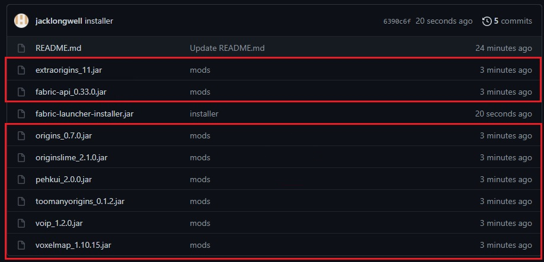

# mc-circus
The Circus' "official" minecraft server

Welcome Circus clowns! This is the tutorial for instalation of everything you need for the minecraft server!
# Installing Fabric Launcher
The first step is setting up the launcher. This is basically a more convoluted version of making another "profile" in minecraft. First you want to download the jar file highlighted in red in the image below

Then you want to double click on that to run it and follow the instructions. minecraft version should be 1.16.5 and laucher version should be 0.11.3

Once done with that you want to launch minecraft on the new profile just to generate the mods file. Then that step is good to go!

# Installing Mods
The next and final step is to add the mods. You want to open minecraft and go to the resource pack pace. Click "Open Pack Folder" and it should open a folder. Navigate backwards to the ".minecraft" folder.

Once there find the "mods" folder. Then install the mods from the Github and you'll be good to go!

Thanks for gaming!